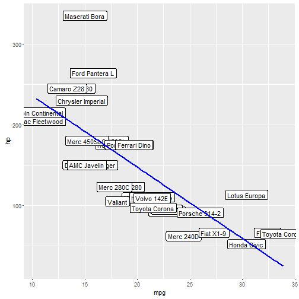
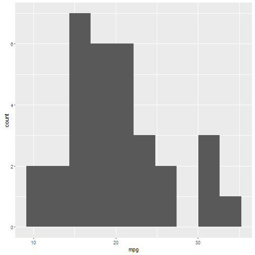

## The Basic Car Research Application

* Buying a car is confusing
* This application allows buyers to compare vehicles quickly
* https://breecejon.shinyapps.io/Basic_Car_Research_Application/ 
* This application will help you compare cars in the mtcars dataset. Use the drop-downs to pick variables for Plot 1.  Use the slider to select the number of bins for Plots 2 and 3. Lastly, use the numeric input box to select how many cars that would like to see in the table at the bottom.

---

## The mtcars dataset

The application relies on the mtcars dataset


```r
head(mtcars)
```

```
##                    mpg cyl disp  hp drat    wt  qsec vs am gear carb
## Mazda RX4         21.0   6  160 110 3.90 2.620 16.46  0  1    4    4
## Mazda RX4 Wag     21.0   6  160 110 3.90 2.875 17.02  0  1    4    4
## Datsun 710        22.8   4  108  93 3.85 2.320 18.61  1  1    4    1
## Hornet 4 Drive    21.4   6  258 110 3.08 3.215 19.44  1  0    3    1
## Hornet Sportabout 18.7   8  360 175 3.15 3.440 17.02  0  0    3    2
## Valiant           18.1   6  225 105 2.76 3.460 20.22  1  0    3    1
```

```r
nrow(mtcars)
```

```
## [1] 32
```

---

## User controls
#### The user has to make four choices:
1. Variable 1: From the mtcars dataset (e.g., mpg, cyl, hp, etc.)
2. Variable 2: From the mtcars dataset (e.g., mpg, cyl, hp, etc.)
3. Number of bins for histograms -- using a slider
4. Number of cars to show in table -- using a numeric input


---

## Outputs
Outputs include three graphs, such as Plot 1:


```
## Warning: package 'ggplot2' was built under R version 3.3.1
```



---

## Thank you

* Thank you for your time.  
* Now check out the app: https://breecejon.shinyapps.io/Basic_Car_Research_Application/

